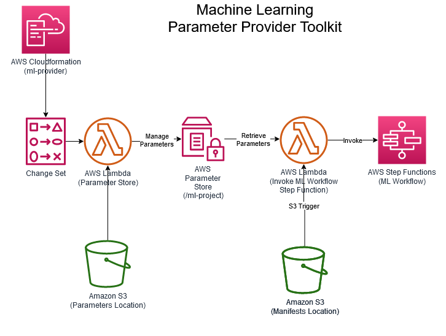
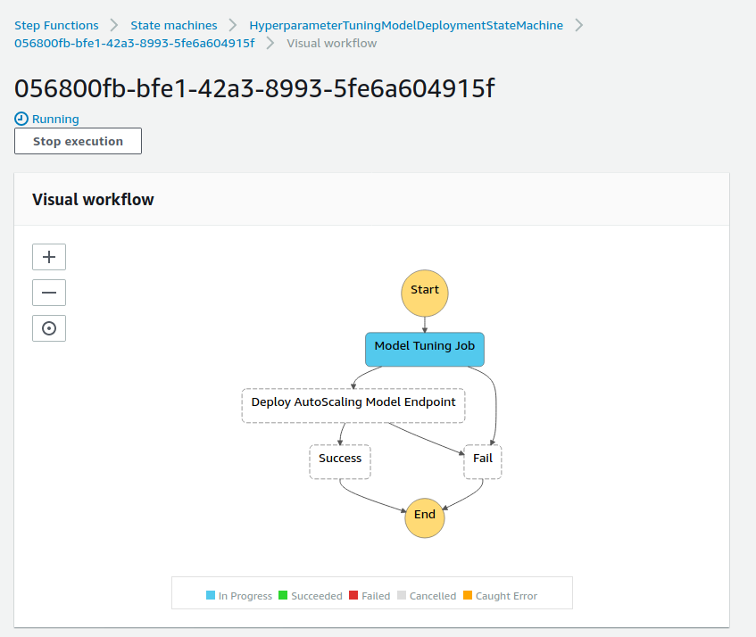
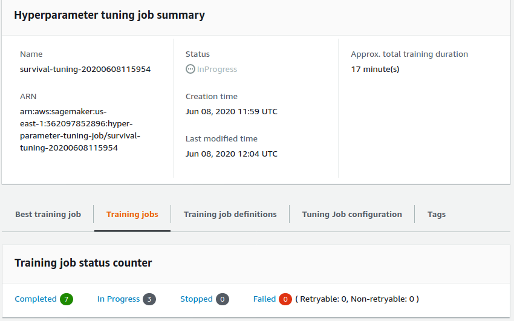

<p align="center">
  
</p>

# ml-parameter-provider
> A Parameter Provider Toolkit for ML Workloads as a Cloudformation stack.

[](contributing.md)
[](https://s3-us-west-2.amazonaws.com/codefactory-us-west-2-prod-default-build-badges/passing.svg)

Current version: **1.0.0**

Lead Maintainer: [Anil Sener](mailto:senera@amazon.com)

## 📋 Table of content

 - [Installation](#-install)
 - [Metrics](#-metrics)
 - [Pre-requisites](#-pre-requisites)
 - [Description](#-description)
 - [Usage](#-usage)
 - [Screenshots](#-screenshots)
 - [See also](#-see-also)

## 🚀 Install

In order to add this block, head to your project directory in your terminal and follow the steps in [Pre-requisites](#-pre-requisites) and [Usage](#-usage) sections below.

> ⚠️ You need to have the [AWS SAM CLI](https://docs.aws.amazon.com/serverless-application-model/latest/developerguide/serverless-sam-cli-install.html) installed on your deployment machine before installing this package.

## 📊 Metrics

The below metrics displays approximate values associated with deploying and using this block.

Metric | Value
------ | ------
**Type** | Architecture
**Installation Time** | Less than 1 minute
**Audience** | Developers, Solutions Architects
**Requirements** | [aws-sam](https://docs.aws.amazon.com/serverless-application-model/latest/developerguide/serverless-sam-cli-install.html),[jq](https://stedolan.github.io/jq/download/)

## 🎒 Pre-requisites

- Make sure that you have installed the [AWS SAM CLI](https://docs.aws.amazon.com/serverless-application-model/latest/developerguide/serverless-sam-cli-install.html) on your deployment machine.
- Make sure that you installed [jq](https://stedolan.github.io/jq/download/) on your deployment machine.
- Make sure you have Python 3.8 installed on your deployment machine.
- Make sure that you have uploaded the [2 required parameter JSON files on S3](#-parameter-json-files) (e.g `ml-parameters.json` and `hyperparameters.json`) before the SAM application deployment.
- Make sure that you have created a ML Workflow State Machine using AWS Step Functions which will be invoked by this stack with ML parameters as an input.

### 📘Parameter JSON files

Below is a list of JSON files that you'd be providing to this stack in order to customize its behavior. Some of them are required before the actual deployment (required at deployment-time), and some are required at run-time.

### Deployment-time dependencies

1. You will find a `template` of `ml-parameters.json` file under `/examples` folder. This file contains all of the customizable parameters required to describe your ML workflow, except hyper-parameters which are described in their own file (see below).

<details><summary>See a template of a ml-parameters.json file</summary>

```json
{
    "tuningJobName": "survival-tuning",
    "tuningStrategy": "Bayesian",
    "algorithmARN": "arn:aws:sagemaker:<region>:<account-id>:algorithm/h2o-gbm-algorithm",
    "maxParallelTrainingJobs": 10,
    "maxNumberOfTrainingJobs": 10,
    "inputContentType": "text/csv",
    "trainingJobDefinitionName": "training-job-def-0",
    "enableManagedSpotTraining": true,
    "spotTrainingCheckpointS3Uri": "s3://<bucket-name>/model-training-checkpoint/",
    "trainingInstanceType": "ml.c5.2xlarge",
    "trainingInstanceVolumeSizeInGB": 30,
    "trainingJobEarlyStoppingType": "Auto",
    "endpointName": "survival-endpoint",
    "model": {
        "artifactType": "MOJO",
        "artifactsS3OutputPath": "s3://<bucket-name>/model-artifacts/",
        "name": "survival-model",
        "trainingSecurityGroupIds": [
            "<security-group-1>"
        ],
        "trainingSubnets": [
            "<subnet-1>",
            "<subnet-2>",
            "<subnet-3>"
        ],
        "hosting": {
            "initialInstanceCount": "1",
            "instanceType": "ml.c5.2xlarge",
            "securityGroupIds": [
                "<security-group-1>"
            ],
            "subnets": [
                "<subnet-1>",
            	   "<subnet-2>",
            	   "<subnet-3>"
            ]
        }
    },
    "autoscalingMinCapacity": 1,
    "autoscalingMaxCapacity": 4,
    "targetTrackingScalingPolicyConfiguration": {
        "DisableScaleIn": true,
        "PredefinedMetricSpecification": {
            "PredefinedMetricType": "SageMakerVariantInvocationsPerInstance"
        },
        "ScaleInCooldown": 300,
        "ScaleOutCooldown": 60,
        "TargetValue": 5000
    }
}
```
</details>

You can generate `ml-parameters.json` file using the scripts based on [jq](https://stedolan.github.io/jq/download/) :

<summary>Linux/MacOs:</summary>

```sh
bash examples/create_example_ml-parameters_file.sh --account <account-id> --region <region> --bucket <s3bucket> --training_sg <training-security-group-id> --training_subnets "<subnet-id-1>,<subnet-id-2>,<subnet-id-3>" --hosting_sg <hosting-group-id> --hosting_subnets "<subnet-id-1>,<subnet-id-2>,<subnet-id-3>
```


<summary>Windows:</summary>

```sh
examples\create_example_ml-parameters_file.bat -jq=<PATH-TO-JQ>\jq-win64.exe -account=<account-id> -region=<region> -bucket=<s3bucket> -training-sg=<training-security-group-id> -training-subnets="<subnet-id-1>,<subnet-id-2>,<subnet-id-3>" -hosting-sg=<hosting-group-id> -hosting-subnets="<subnet-id-1>,<subnet-id-2>,<subnet-id-3>"
```


Upload this generated JSON file in to the root folder in the S3 Bucket (you will pass this S3 Bucket during the deployment).

```sh
aws s3 cp examples/ml-parameters.json s3://<s3bucket>/
```


> ⚠️ Please note that the maximum number of characters for `tuningJobName`, `endpointName`, `trainingJobDefinitionName` should be `17` as date/time suffix is added in Sagemaker API creation to these fields during Step Function invocation.

2. You will find a template of `hyperparameters.json` file under `/examples` folder

<details><summary>See a sample of a hyperparameters.json file</summary>

```json
{
"parameterRanges": {
    "IntegerParameterRanges": [
      {
        "Name": "ntrees",
        "MinValue": "10",
        "MaxValue": "100",
        "ScalingType": "Linear"
      },
      {
        "Name": "min_rows",
        "MinValue": "10",
        "MaxValue": "30",
        "ScalingType": "Linear"
      },
      {
        "Name": "max_depth",
        "MinValue": "3",
        "MaxValue": "7",
        "ScalingType": "Linear"
      },
      {
        "Name": "score_tree_interval",
        "MinValue": "5",
        "MaxValue": "10",
        "ScalingType": "Linear"
      }
    ],
    "ContinuousParameterRanges": [
      {
        "Name": "learn_rate",
        "MinValue": "0.001",
        "MaxValue": "0.01",
        "ScalingType": "Logarithmic"
      },
      {
        "Name": "sample_rate",
        "MinValue": "0.6",
        "MaxValue": "1.0",
        "ScalingType": "Auto"
      },
      {
        "Name": "col_sample_rate",
        "MinValue": "0.7",
        "MaxValue": "0.9",
        "ScalingType": "Auto"
      }
    ],
    "CategoricalParameterRanges": [

    ]
  },
  "staticHyperParameters":{
      "stopping_metric":"auc",
      "training": "{'classification': 'true', 'target': 'Survived', 'distribution':'bernoulli','ignored_columns':'PassengerId,Name,Cabin,Ticket','categorical_columns':'Sex,Embarked,Survived,Pclass,Embarked'}",
      "balance_classes":"True",
      "seed": "1",
      "stopping_rounds":"10",
      "stopping_tolerance":"1e-9"
  }
}
```
</details>

Upload this file in to the root folder in the S3 Bucket (you will pass this S3 Bucket during the deployment).

```sh
aws s3 cp examples/hyperparameters.json s3://<s3bucket>/
```


### Run-time dependencies

1. Upload train.csv and validation.csv files to their dedicated directories in the  S3 bucket. (This block provides flexiblity to specify any number of model training input channels more than 1)

See the sample s3 copy commands below:
```sh
aws s3 cp examples/train.csv s3://<s3bucket>/titanic/training/
aws s3 cp examples/validation.csv s3://<s3bucket>/titanic/validation/
```

2. You will find below an example of a `manifest.json` file. This file describes the input data channels to be used by your ML workflow during the traning process or batch inference.

This JSON file includes parameters which will be used at run-time by this stack. Therefore, it is not necessary to have this file created during the deployment. Please find some example of ML Workflows in the [See Also](#See-Also) section.

<details><summary>See a sample of a manifest file</summary>

```json
{
  "channels": [
    {
      "channelName": "training",
      "s3DataSource": {
        "AttributeNames": [],
        "S3DataDistributionType": "FullyReplicated",
        "S3DataType": "S3Prefix",
        "S3Uri": "s3://<s3bucket>/titanic/training/train.csv"
      }
    },
    {
      "channelName": "validation",
      "s3DataSource": {
        "AttributeNames": [],
        "S3DataDistributionType": "FullyReplicated",
        "S3DataType": "S3Prefix",
        "S3Uri": "s3://<s3bucket>/titanic/validation/validation.csv"
      }
    }
  ]
}
```
</details>

## 🔰 Description

This block is used to import ML Workflow Parameters from AWS Systems Manager Parameter Store required by ML Workflows like Model Training, Tuning & Deployment which are orchestrated by AWS Step Functions. It also provides a Lambda Function which can retrieve these parameters to execute an ML Workflow State Machine specified during the Toolkit Deployment.


<p align="center">
  
</p>

## 🛠 Usage

1. Deploy the package via the SAM CLI providing the settings for deployment.

```sh
sam deploy --guided
```

2. Observe the deployed `ml-parameter-provider` Serverless Application in the AWS Console.

3. Navigate to Amazon S3 console, create a manifest.json file and upload to the S3 location previously specified by `ManifestS3BucketName` and `ManifestS3BucketKeyPrefix` options during the toolkit deployment.

4. A new execution of the state machine specified in `TargetStateMachineArn` deployment option will be triggered and the deployment will start.

### SAM CLI Deployment Options

The deployment options that you can pass to the ML Parameter Provider toolkit are described below.

Name           | Default value | Description
-------------- | ------------- | -----------
**Stack Name** | sam-app       | Name of the stack/serverless application for example `ml-parameter-provider`.
**AWS Region** | None          | AWS Region to deploy the infrastructure for ML Parameter Provider Serverless Application.
**Parameter Environment** | `development` | Environment to tag the created resources.
**ParameterStorePath** | `/ml-project` | Parent path in AWS Systems Manager Parameter Store to store all parameters imported by the toolkit. It is recommended to set this to a meaningful ML project/domain name.
**TargetStateMachineArn** | None | Amazon Resource Name of AWS Step Functions State Machine which will be executed using parameters in parameter store.
**ManifestS3BucketName** | None | Please set the S3 bucket name where manifest JSON files will be uploaded.
**ManifestS3BucketKeyPrefix** | `manifests/` | Please set the S3 key prefix where manifest JSON files will be uploaded.
**HyperparametersS3BucketName** | None | Please set the S3 bucket name where hyperparameter JSON file to be read from during the deployment.
**HyperparametersS3Key** | `hyperparameters.json` | Please set the S3 key prefix where hyperparameters JSON files will be uploaded.
**ParametersS3BucketName** | None | Please set the S3 bucket name where parameters JSON file to be read from during the deployment.
**ParametersS3Key** | `ml-parameters.json` | Please set the S3 key prefix where parameters JSON files will be uploaded.


## 📷 Screenshots

Below are different screenshots displaying sexecution of ML Workflow AWS Step Function and Model Tuning looks like in the AWS Console.

### The state machine during execution

You can see below a current execution of the `HyperparameterTuningModelDeploymentStateMachine` in the AWS Step Functions console.


<p align="center">
  
</p>

### The Sagemaker Hyperparameter Tuning Job during execution

Below is a screenshot of training jobs with `InProgress` status created by Sagemaker Hyperparameter Tuning Job.


<p align="center">
  
</p>

## 👀 See also

 - The [AWS Sagemaker](https://docs.aws.amazon.com/sagemaker/latest/dg/whatis.html) official documentation.
 - The [AWS Steps Function](https://docs.aws.amazon.com/step-functions/latest/dg/welcome.html) official documentation.
 - The [Sagemaker Model Tuner with Endpoint Deployment](https://github.com/aws-samples/amazon-sagemaker-h2o-blog/tree/master/sagemaker-model-tuner-with-endpoint-deployment) AWS Block.
 - The [Sagemaker Model Tuner](https://github.com/aws-samples/amazon-sagemaker-h2o-blog/tree/master/sagemaker-model-tuner) AWS Block.
 - The [Sagemaker Model Deployer](https://github.com/aws-samples/amazon-sagemaker-h2o-blog/tree/master/sagemaker-model-deployer) AWS Block.
