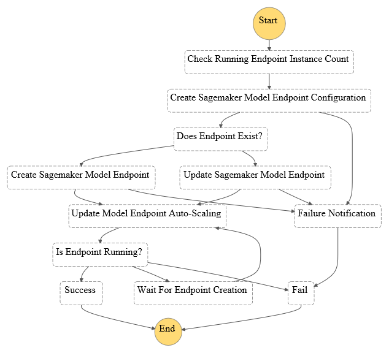
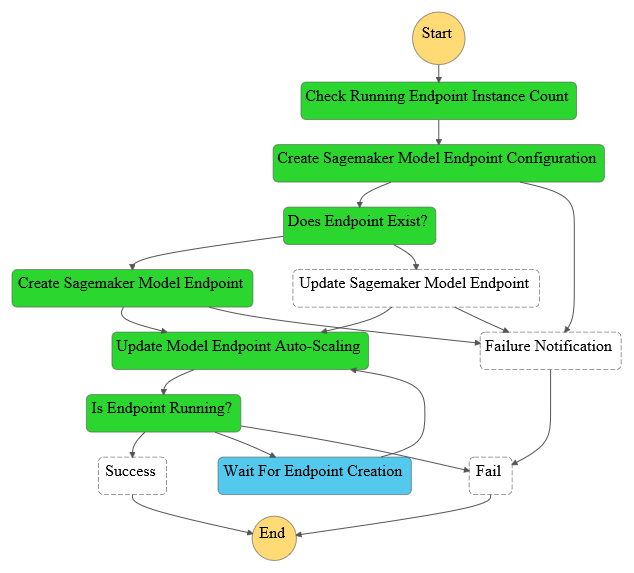
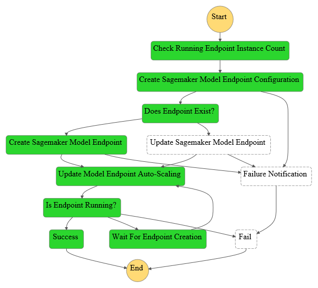
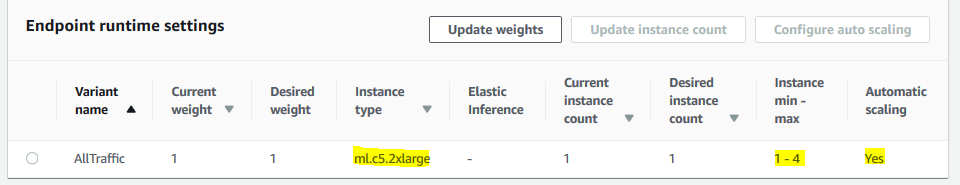

<br /><br />
<p align="center">
  
</p><br /><br />

# sagemaker-endpoint-deployer
> Auto-Scaling Sagemaker Model Endpoint Deployment Serverless Application as a Cloudformation stack.

[](contributing.md)
[](https://s3-us-west-2.amazonaws.com/codefactory-us-west-2-prod-default-build-badges/passing.svg)

Current version: **2.0.0**

Lead Maintainer: [Anil Sener](mailto:senera@amazon.com)

## 📋 Table of content

 - [Installation](#-install)
 - [Metrics](#-metrics)
 - [Pre-requisites](#-pre-requisites)
 - [Description](#-description)
 - [Usage](#-usage)
 - [Screenshots](#-screenshots)
 - [See also](#-see-also)

## 🚀 Install

In order to add this block, head to your project directory in your terminal and follow the steps in [Pre-requisites](#-pre-requisites) and [Usage](#-usage) sections below.

> ⚠️ You need to have the [AWS SAM CLI](https://docs.aws.amazon.com/serverless-application-model/latest/developerguide/serverless-sam-cli-install.html) installed on your deployment machine before installing this package.

## 📊 Metrics

The below metrics displays approximate values associated with deploying and using this block.

Metric | Value
------ | ------
**Type** | Architecture
**Installation Time** | Less than 1 minute
**Audience** | Developers, Solutions Architects
**Requirements** | [aws-sam](https://docs.aws.amazon.com/serverless-application-model/latest/developerguide/serverless-sam-cli-install.html),[Python3.8](https://www.python.org/downloads/)

## 🎒 Pre-requisites

 - Make sure that you have installed the [AWS SAM CLI](https://docs.aws.amazon.com/serverless-application-model/latest/developerguide/serverless-sam-cli-install.html) on your deployment machine.
 - Make sure that you have a [Amazon Sagemaker Model Resource](https://docs.aws.amazon.com/sagemaker/latest/APIReference/API_CreateModel.html) created in the AWS region in which you will execute the step-function associated with this block.
 - Make sure that your Sagemaker ML hosting endpoint is provisioned with enough service limits (e.g hosting limits).
 - Make sure that [AWS Application Auto-scaling](https://docs.aws.amazon.com/autoscaling/application/userguide/what-is-application-auto-scaling.html) is generally available in the AWS region in which you will execute the step-function associated with this block.
 
## 🔰 Description

This block is to build the infrastucture required to implement an Auto-scaling Amazon Sagemaker Model Endpoint Deployment Process given that at least one [Amazon Sagemaker Model Resource](https://docs.aws.amazon.com/autoscaling/application/userguide/what-is-application-auto-scaling.html) is already created. It creates a Step Function called `AutoScalingModelEndpointDeploymentStateMachine` which natively integrates with Amazon Sagemaker, AWS Lambda & Amazon SNS entities that are created. This block can be used both as a standalone project or a dependency for other AWS blocks which will involves an Auto-scaling Amazon Sagemaker Model Endpoint at any stage.

<br /><br />
<p align="center">
  
</p><br />

## 🛠 Usage

1. Deploy the package via the SAM CLI providing the settings for deployment.
```sh
sam deploy --guided
```
2. Observe the deployed `sagemaker-model-deployer` Serverless Application in the AWS Console.

3. Navigate to the `AutoScalingModelEndpointDeploymentStateMachine` step function in the AWS Console.

4. Select the `Start Execution` button and submit the below JSON payload.

<details><summary>See a sample of JSON payload</summary>
<p>

```json
{
  "endpointName": "test-endpoint",
  "productionVariants": [{
    "AcceleratorType": "ml.eia1.medium",
    "InitialInstanceCount": 1,
    "InitialVariantWeight": 1,
    "InstanceType": "ml.c5.2xlarge",
    "ModelName": "h2o3-gbm-2019-10-22-17-57-58",
    "VariantName": "AllTraffic"
  }],
  "autoscalingMinCapacity": 1,
  "autoscalingMaxCapacity": 4,
  "targetTrackingScalingPolicyConfiguration": {
    "TargetValue": 5000.0,
    "PredefinedMetricSpecification": {
      "PredefinedMetricType": "SageMakerVariantInvocationsPerInstance"
    },
    "ScaleOutCooldown": 60,
    "ScaleInCooldown": 300,
    "DisableScaleIn": false
  }
}
```

</p>
</details>

5. A new execution of the state machine will be triggered and the deployment will start.

### SAM CLI Deployment Options

The deployment options that you can pass to the Sagemaker Model Deployer Serverless Application are described below.

Name           | Default value | Description
-------------- | ------------- | -----------
**Stack Name** | sam-app       | Name of the stack/serverless application for example `sagemaker-model-deployer`.
**AWS Region** | None          | AWS Region to deploy the infrastructure for Sagemaker Model Deployer Serverless Application.
**Parameter Environment** | development | Environment to tag the created resources.

### Step Function Invocation Parameters

The different parameters that you can pass to the auto-scaling endpoint deployment step-function are described below.

Name           | Description
-------------- | -------------
**endpointName** | Name of Amazon Sagemaker Model Endpoint.
**productionVariants** | At least one production variant should be defined for the process, you can create multiple production variants to deploy multiple models.
**- InitialInstanceCount** | Initial number of Instances at the creation time of Amazon Sagemaker Model Endpoint.
**- inferenceInstanceType** | Instance type which is allowed to be used by Amazon Sagemaker Model.
**- modelName** | Name of Sagemaker Model, exatly as defined in Amazon Sagemaker API.
**- AcceleratorType** | (Optional) - Elastic Inference Accelerator Type for Amazon Sagemaker Model Endpoint.
**autoscalingMinCapacity** | Minimum Number of Instances allowed to Scale In by Automatic Scaling Mechanism.
**autoscalingMaxCapacity** | Maximum Number of Instances allowed to Scale Out by Automatic Scaling Mechanism.
**targetTrackingScalingPolicyConfiguration** | (Optional) - Should be filled to customize the default Target Tracking Automatic Scaling Policy.

<br />

## 📷 Screenshots

Below are different screenshots displaying how the different stage of a deployment looks like in the AWS Console.

### The state machine during execution

You can see below a current execution of the deployment state machine in the AWS Step Functions console.

<br />
<p align="center">
  
</p><br />

### The state machine after a successful completion

You can see below a screenshot of a successful deployment operated by the deployment state machine in the AWS Step Functions console.

<br />
<p align="center">
  
</p><br />

### Deployed Auto-Scaling Amazon Sagemaker Model Enpoint

Below is a screenshot of the endpoint that has been successfully deployed by this step-function in the AWS Console.

<br />
<p align="center">
  
</p><br />

Below is a screenshot of the `Endpoint Runtime Settings` associated with the auto-scaling Amazon Sagemaker Endpoint that has been successfully deployed by this step-function in the AWS Console.

<br />
<p align="center">
  
</p><br />

## 👀 See also

 - The [AWS Sagemaker](https://docs.aws.amazon.com/sagemaker/latest/dg/whatis.html) official documentation.
 - The [AWS Steps Function](https://docs.aws.amazon.com/step-functions/latest/dg/welcome.html) official documentation.
 - The [ML Parameter Provider](https://github.com/aws-samples/amazon-sagemaker-h2o-blog/tree/master/ml-parameter-provider) AWS Block.
 - The [H2O GBM Predictor](https://github.com/aws-samples/amazon-sagemaker-h2o-blog/tree/master/h2o-gbm-predictor) AWS Block.
