<p align="center">
  
</p>

# sagemaker-model-tuner-with-endpoint-deployment
> A Sagemaker Model Hyperparameter Tuning and Endpoint Deployment Serverless Application as a Cloudformation stack.

[](contributing.md)
[](https://s3-us-west-2.amazonaws.com/codefactory-us-west-2-prod-default-build-badges/passing.svg)

Current version: **1.0.0**

Lead Maintainer: [Anil Sener](mailto:senera@amazon.com)

## 📋 Table of content

 - [Installation](#-install)
 - [Metrics](#-metrics)
 - [Pre-requisites](#-pre-requisites)
 - [Description](#-description)
 - [Usage](#-usage)
 - [Screenshots](#-screenshots)
 - [See also](#-see-also)

## 🚀 Install

In order to add this block, head to your project directory in your terminal and follow the steps in [Pre-requisites](#-pre-requisites) and [Usage](#-usage) sections below.

> ⚠️ You need to have the [AWS SAM CLI](https://docs.aws.amazon.com/serverless-application-model/latest/developerguide/serverless-sam-cli-install.html) installed on your deployment machine before installing this package.

## 📊 Metrics

The below metrics displays approximate values associated with deploying and using this block.

Metric | Value
------ | ------
**Type** | Architecture
**Installation Time** | Less than 3 minutes
**Audience** | Developers, Solutions Architects
**Requirements** | [aws-sam](https://docs.aws.amazon.com/serverless-application-model/latest/developerguide/serverless-sam-cli-install.html),[Python3.8](https://www.python.org/downloads/),[jq](https://stedolan.github.io/jq/download/)


## 🎒 Pre-requisites

 - Make sure that you have installed the [AWS SAM CLI](https://docs.aws.amazon.com/serverless-application-model/latest/developerguide/serverless-sam-cli-install.html) on your deployment machine.
 - Make sure that you installed [jq](https://stedolan.github.io/jq/download/) on your deployment machine. 
 - Make sure that you have a [Sagemaker Algorithm Resource](https://docs.aws.amazon.com/sagemaker/latest/dg/sagemaker-mkt-create-algo.html) or a [Sagemaker Algorithm on AWS Marketplace](https://docs.aws.amazon.com/sagemaker/latest/dg/sagemaker-marketplace.html) already created in the AWS region in which you will execute the step-function associated with this block. A Sagemaker Algorithm Resource requires model training and inference docker image URIs. These images can be either [pre-built](https://docs.aws.amazon.com/sagemaker/latest/dg/sagemaker-algo-docker-registry-paths.html) or custom. You can create a [Sagemaker Algorithm Resource](https://docs.aws.amazon.com/sagemaker/latest/dg/sagemaker-mkt-create-algo.html) taking [H2O GBM Algorithm Resource](https://github.com/aws-samples/amazon-sagemaker-h2o-blog/tree/master/h2o-gbm-algorithm-resource) AWS Block as a reference.
 - Make sure that your Sagemaker Hyperparameter Tuning Job is provisioned with enough service limits (e.g model training, managed spot training, max parallel training, hosting job limits).
 - Make sure that [AWS Application Auto-scaling](https://docs.aws.amazon.com/autoscaling/application/userguide/what-is-application-auto-scaling.html) is generally available in the AWS region in which you will execute the step-function associated with this block.
 - Make sure that you have uploaded the [2 required parameter JSON files on S3](#-parameter-json-files) (e.g `ml-parameters.json` and `hyperparameters.json`) before the SAM application deployment.
 - Make sure that you have a [S3 VPC endpoint](https://docs.aws.amazon.com/vpc/latest/userguide/vpc-endpoints-s3.html) or a [VPC NAT device](https://docs.aws.amazon.com/vpc/latest/userguide/vpc-nat.html) associated to the subnets defined for model tuning process.

## 📘Parameter JSON files

Below is a list of JSON files that you'd be providing to this stack in order to customize its behavior. Some of them are required before the actual deployment (required at deployment-time), and some are required at run-time.

### Deployment-time dependencies

1. You will find a `template` of `ml-parameters.json` file under `/examples` folder. This file contains all of the customizable parameters required to describe your ML workflow, except hyper-parameters which are described in their own file (see below).

<details><summary>See a template of a ml-parameters.json file</summary>

```json
{
    "tuningJobName": "survival-tuning",
    "tuningStrategy": "Bayesian",
    "algorithmARN": "arn:aws:sagemaker:<region>:<account-id>:algorithm/h2o-gbm-algorithm",
    "maxParallelTrainingJobs": 10,
    "maxNumberOfTrainingJobs": 10,
    "inputContentType": "text/csv",
    "trainingJobDefinitionName": "training-job-def-0",
    "enableManagedSpotTraining": true,
    "spotTrainingCheckpointS3Uri": "s3://<bucket-name>/model-training-checkpoint/",
    "trainingInstanceType": "ml.c5.2xlarge",
    "trainingInstanceVolumeSizeInGB": 30,
    "trainingJobEarlyStoppingType": "Auto",
    "endpointName": "survival-endpoint",
    "model": {
        "artifactType": "MOJO",
        "artifactsS3OutputPath": "s3://<bucket-name>/model-artifacts/",
        "name": "survival-model",
        "trainingSecurityGroupIds": [
            "<security-group-1>"
        ],
        "trainingSubnets": [
            "<subnet-1>",
            "<subnet-2>",
            "<subnet-3>"
        ],
        "hosting": {
            "initialInstanceCount": "1",
            "instanceType": "ml.c5.2xlarge",
            "securityGroupIds": [
                "<security-group-1>"
            ],
            "subnets": [
                "<subnet-1>",
            	   "<subnet-2>",
            	   "<subnet-3>"
            ]
        }
    },
    "autoscalingMinCapacity": 1,
    "autoscalingMaxCapacity": 4,
    "targetTrackingScalingPolicyConfiguration": {
        "DisableScaleIn": true,
        "PredefinedMetricSpecification": {
            "PredefinedMetricType": "SageMakerVariantInvocationsPerInstance"
        },
        "ScaleInCooldown": 300,
        "ScaleOutCooldown": 60,
        "TargetValue": 5000
    }
}
```
</details>

You can generate `ml-parameters.json` file using the scripts based on [jq](https://stedolan.github.io/jq/download/) :

#### Linux/MacOs:

```sh
bash examples/create_example_ml-parameters_file.sh --account <account-id> --region <region> --bucket <s3bucket> --training_sg <training-security-group-id> --training_subnets "<subnet-id-1>,<subnet-id-2>,<subnet-id-3>" --hosting_sg <hosting-security-group-id> --hosting_subnets "<subnet-id-1>,<subnet-id-2>,<subnet-id-3>
```

#### Windows:

```sh
examples\create_example_ml-parameters_file.bat -jq=<PATH-TO-JQ>\jq-win64.exe -account=<account-id> -region=<region> -bucket=<s3bucket> -training-sg=<training-security-group-id> -training-subnets="<subnet-id-1>,<subnet-id-2>,<subnet-id-3>" -hosting-sg=<hosting-security-group-id> -hosting-subnets="<subnet-id-1>,<subnet-id-2>,<subnet-id-3>"
```

Upload this generated JSON file in to the root folder in the S3 Bucket (you will pass this S3 Bucket during the deployment).

```sh
aws s3 cp examples/ml-parameters.json s3://<s3bucket>/
```


> ⚠️ Please note that the maximum number of characters for `tuningJobName`, `endpointName`, `trainingJobDefinitionName` should be `17` as date/time suffix is added in Sagemaker API creation to these fields during Step Function invocation.

2. You will find a template of `hyperparameters.json` file under `/examples` folder

<details><summary>See a sample of a hyperparameters.json file</summary>

```json
{
"parameterRanges": {
    "IntegerParameterRanges": [
      {
        "Name": "ntrees",
        "MinValue": "10",
        "MaxValue": "100",
        "ScalingType": "Linear"
      },
      {
        "Name": "min_rows",
        "MinValue": "10",
        "MaxValue": "30",
        "ScalingType": "Linear"
      },
      {
        "Name": "max_depth",
        "MinValue": "3",
        "MaxValue": "7",
        "ScalingType": "Linear"
      },
      {
        "Name": "score_tree_interval",
        "MinValue": "5",
        "MaxValue": "10",
        "ScalingType": "Linear"
      }
    ],
    "ContinuousParameterRanges": [
      {
        "Name": "learn_rate",
        "MinValue": "0.001",
        "MaxValue": "0.01",
        "ScalingType": "Logarithmic"
      },
      {
        "Name": "sample_rate",
        "MinValue": "0.6",
        "MaxValue": "1.0",
        "ScalingType": "Auto"
      },
      {
        "Name": "col_sample_rate",
        "MinValue": "0.7",
        "MaxValue": "0.9",
        "ScalingType": "Auto"
      }
    ],
    "CategoricalParameterRanges": [

    ]
  },
  "staticHyperParameters":{
      "stopping_metric":"auc",
      "training": "{'classification': 'true', 'target': 'Survived', 'distribution':'bernoulli','ignored_columns':'PassengerId,Name,Cabin,Ticket','categorical_columns':'Sex,Embarked,Survived,Pclass,Embarked'}",
      "balance_classes":"True",
      "seed": "1",
      "stopping_rounds":"10",
      "stopping_tolerance":"1e-9"
  }
}
```
</details>

Upload this file in to the root folder in the S3 Bucket (you will pass this S3 Bucket during the deployment).

```sh
aws s3 cp examples/hyperparameters.json s3://<s3bucket>/
```


### Run-time dependencies

1. Upload train.csv and validation.csv files to their dedicated directories in the  S3 bucket. (This block provides flexiblity to specify any number of model training input channels more than 1)

See the sample s3 copy commands below:
```sh
aws s3 cp examples/train.csv s3://<s3bucket>/titanic/training/
aws s3 cp examples/validation.csv s3://<s3bucket>/titanic/validation/
```

2. You will find below an example of a `manifest.json` file. This file describes the input data channels to be used by your ML workflow during the traning process or batch inference.

This JSON file includes parameters which will be used at run-time by this stack. Therefore, it is not necessary to have this file created during the deployment. Please find some example of ML Workflows in the [See Also](#See-Also) section.

<details><summary>See a sample of a manifest file</summary>

```json
{
  "channels": [
    {
      "channelName": "training",
      "s3DataSource": {
        "AttributeNames": [],
        "S3DataDistributionType": "FullyReplicated",
        "S3DataType": "S3Prefix",
        "S3Uri": "s3://<s3bucket>/titanic/training/train.csv"
      }
    },
    {
      "channelName": "validation",
      "s3DataSource": {
        "AttributeNames": [],
        "S3DataDistributionType": "FullyReplicated",
        "S3DataType": "S3Prefix",
        "S3Uri": "s3://<s3bucket>/titanic/validation/validation.csv"
      }
    }
  ]
}
```
</details>

## 🔰 Description

This block is to build the infrastucture required to implement an Amazon Sagemaker Model Hyperparameter Tuning and Auto-Scaling Model Endpoint Deployment Process.

This project creates also 3 nested serverless applications defined by [ML Parameter Provider](https://github.com/aws-samples/amazon-sagemaker-h2o-blog/tree/master/ml-parameter-provider), [Sagemaker Model Tuner](https://github.com/aws-samples/amazon-sagemaker-h2o-blog/tree/master/sagemaker-model-tuner) and [Sagemaker Model Deployer](https://github.com/aws-samples/amazon-sagemaker-h2o-blog/tree/master/sagemaker-model-deployer) AWS blocks. 

This project creates a parent Step Function called `ModelTuningWithEndpointDeploymentStateMachine` which natively integrates with Amazon Step Functions entities that are defined by [Sagemaker Model Tuner](https://github.com/aws-samples/amazon-sagemaker-h2o-blog/tree/master/sagemaker-model-tuner) and [Sagemaker Model Deployer](https://github.com/aws-samples/amazon-sagemaker-h2o-blog/tree/master/sagemaker-model-deployer) AWS blocks. Below is the screenshot of `ModelTuningWithEndpointDeploymentStateMachine`, which is composing 2 nested workflows:


<p align="center">
  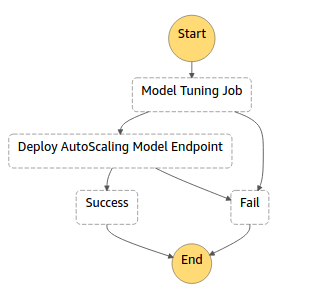
</p>

This block can be used both as a standalone project or a dependency for other AWS blocks which will involves an Amazon Sagemaker Model Tuning & Auto-Scaling Model Endpoint Deployment at any stage. Below is the architectural diagram of the created ML workflow:


<p align="center">
  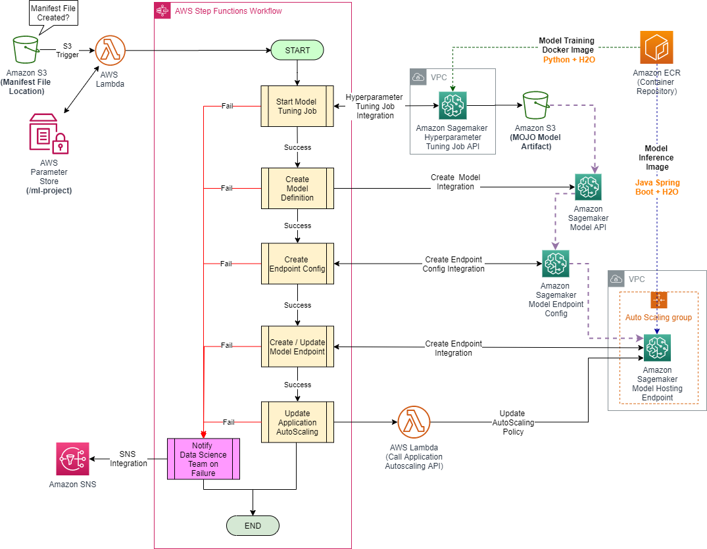
</p>

## 🛠 Usage

1. Deploy the package via the NPM providing the settings for deployment. Please check the [Deployment Options](#Deployment-Options) that you can set below. 

#### Linux/MacOs:

```sh
npm run deploy --region=<region> ^
--s3bucket=<s3bucket> ^
--environment=<environment> ^
--paramstorepath=<paramstorepath>
```

#### Windows:

```sh
npm run deploy-win --region=<region> \
--s3bucket=<s3bucket> \
--environment=<environment> \
--paramstorepath=<paramstorepath>
```

Note: When deployment is completed, please check `MLParameterProviderApplication`, `ModelTuningApplication` and `AutoScalingModelEndpointDeploymentApplication` Serverless Applications  in the AWS Console.

2. Navigate to the `ModelTuningWithEndpointDeploymentStateMachine` step function in the AWS Console.

3. Navigate to Amazon S3 console, create a manifest.json file and upload to the S3 location previously specified by `ManifestS3BucketName` and `ManifestS3BucketKeyPrefix` options during the toolkit deployment.

### Deployment Options

The deployment options that you can pass to this solution are described below.

Name           | Default value | Description
-------------- | ------------- | -----------
**region** | None | AWS Region to deploy the infrastructure for Sagemaker Model Hyperparameter Tuning and Endpoint Deployment Serverless Application.
**s3bucket** | None | Please set the S3 bucket name where manifest, `hyperparameters.json` and `ml-parameters.json` JSON files will be uploaded.
**environment** | `development` | Environment to tag the created resources.
**paramstorepath** | `/ml-project` | Parent path in AWS Systems Manager Parameter Store to store all parameters imported by the toolkit. It is recommended to set this to a meaningful ML project/domain name.

## 📷 Screenshots

Below are different screenshots displaying how the different stage of a Model Tuning with Auto-scaling Endpoint Deployment Process looks like in the AWS Console.

### The state machine during model tuning execution

You can see below a model tuning execution of the `ModelTuningWithEndpointDeploymentStateMachine` in the AWS Step Functions console.


<p align="center">
  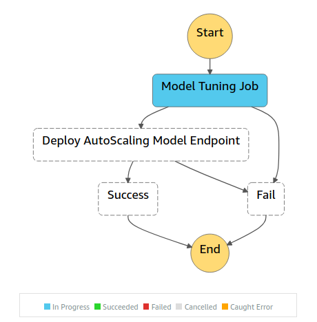
</p>

### The Sagemaker Hyperparameter Tuning Job during execution

Below is a screenshot of training jobs with `InProgress` status created by Sagemaker Hyperparameter Tuning Job.


<p align="center">
  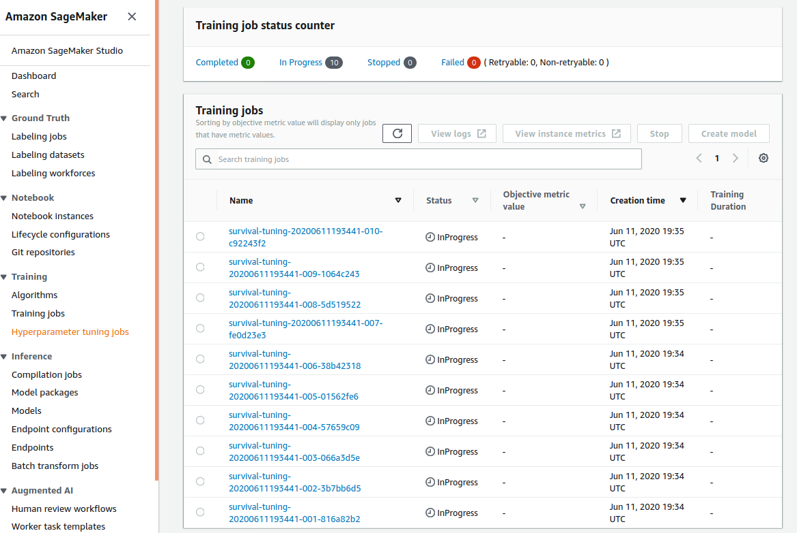
</p>


### The Sagemaker Hyperparameter Tuning Job after successful completion

Below is a screenshot of training jobs with `Completed` and `Stopped` (due to early stopping feature) status created by Sagemaker Hyperparameter Tuning Job.


<p align="center">
  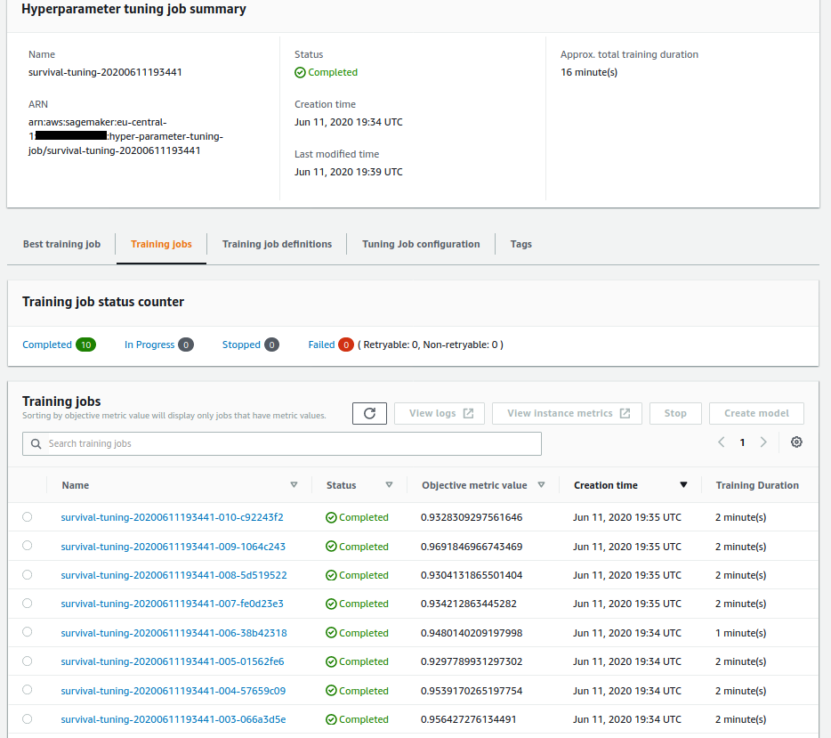
</p>

Below is a screenshot of the performance and configuration details of the training job which created the best model selected by Sagemaker Hyperparameter Tuning Job.


<p align="center">
  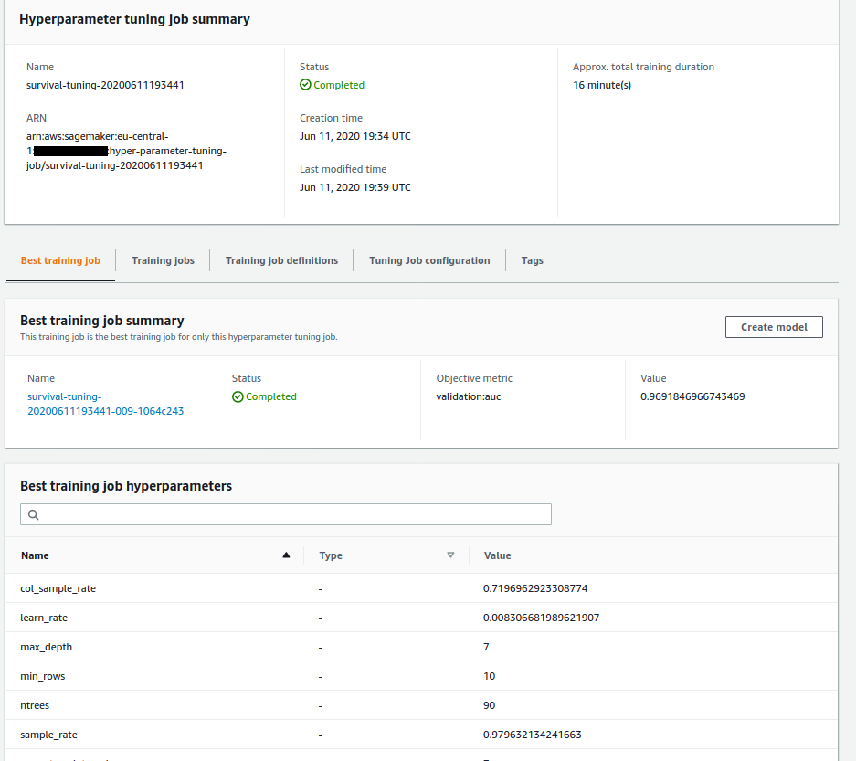
</p>

### Created Amazon Sagemaker Model

Navigate to `SageMaker Model` link to display the Sagemaker Model Definition in detail.


<p align="center">
  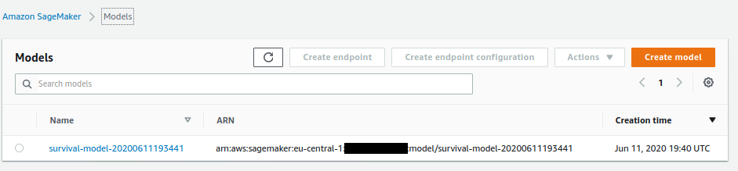
</p>


Below is a screenshot of the detailed settings associated with the Sagemaker Model such as the location of model artifact and inference image reference in the AWS Console.


<p align="center">
  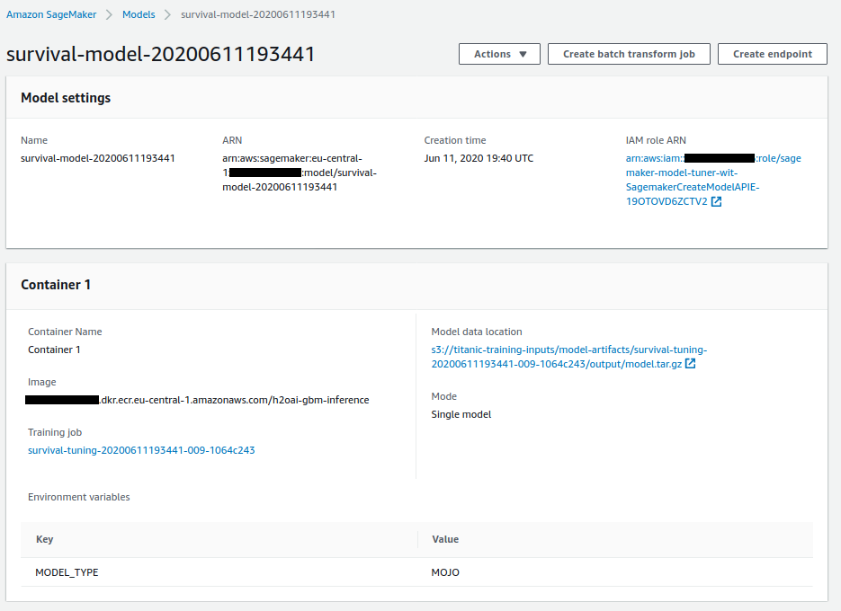
</p>

### The state machine during model deployment execution

You can see below a model deployment execution of the `ModelTuningWithEndpointDeploymentStateMachine` in the AWS Step Functions console.


<p align="center">
  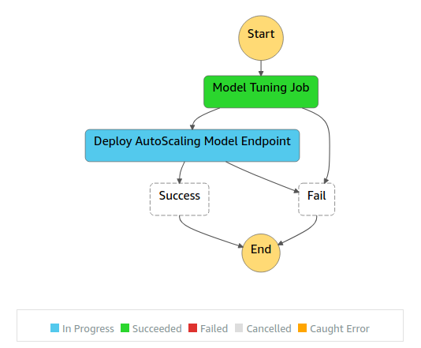
</p>

Below is a screenshot of the `Sagemaker Model Endpoint` during the deployment.


<p align="center">
  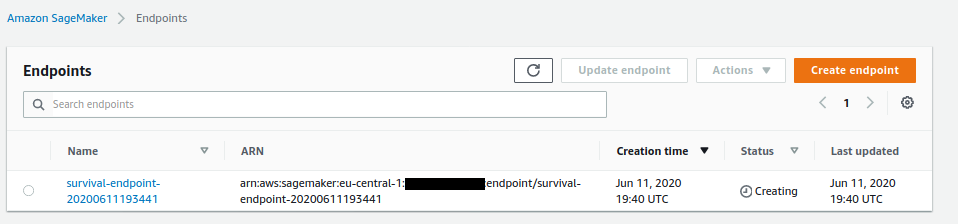
</p>

### The state machine after completion

You can see below a screenshot of a successfully Model tuning and deployment process operated by `ModelTuningWithEndpointDeploymentStateMachine` in the AWS Step Functions console.


<p align="center">
  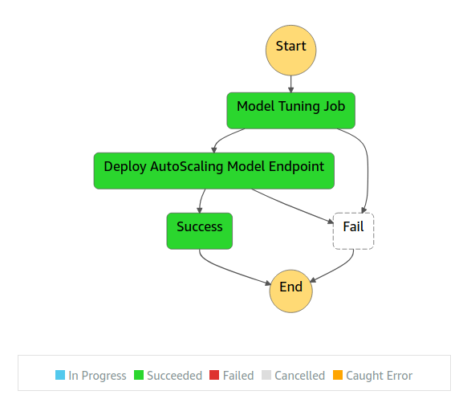
</p>

### Deployed Auto-Scaling Amazon Sagemaker Model Enpoint

Below is a screenshot of the `Sagemaker Model Endpoint` that has been successfully deployed by this Step Function in the AWS Console.


<p align="center">
  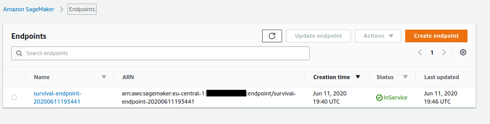
</p>

Below is a screenshot of the `Endpoint Runtime Settings` associated with the auto-scaling Amazon Sagemaker Endpoint that has been successfully deployed by this Step Function in the AWS Console.


<p align="center">
  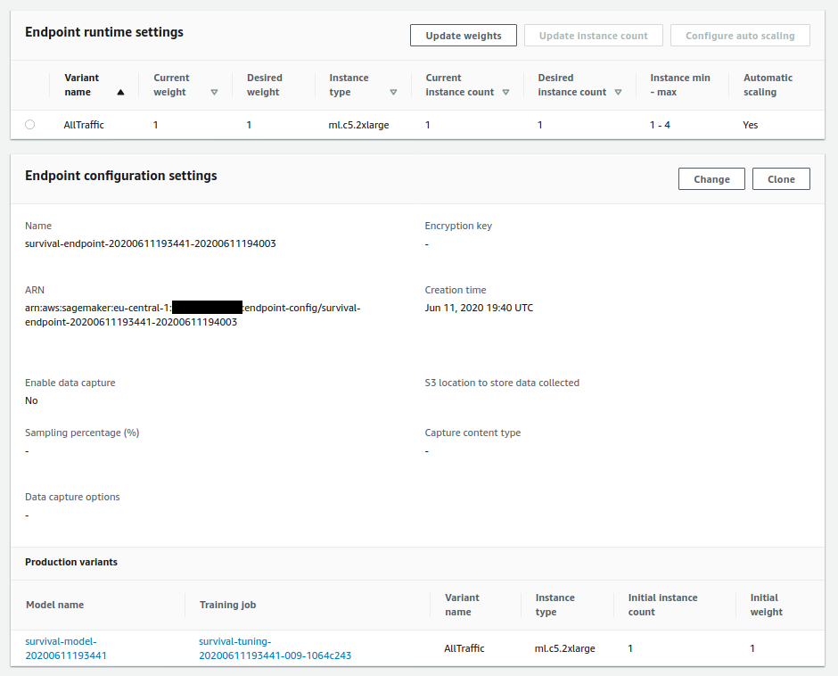
</p>

## 👀 See also

 - The [AWS Sagemaker](https://docs.aws.amazon.com/sagemaker/latest/dg/whatis.html) official documentation.
 - The [AWS Steps Function](https://docs.aws.amazon.com/step-functions/latest/dg/welcome.html) official documentation.
 - The [Sagemaker Model Tuner](https://github.com/aws-samples/amazon-sagemaker-h2o-blog/tree/master/sagemaker-model-tuner) AWS Block.
 - The [Sagemaker Model Deployer](https://github.com/aws-samples/amazon-sagemaker-h2o-blog/tree/master/sagemaker-model-deployer) AWS Block.
 - The [ML Parameter Provider](https://github.com/aws-samples/amazon-sagemaker-h2o-blog/tree/master/ml-parameter-provider) AWS Block.
 - The [H2O GBM Trainer](https://github.com/aws-samples/amazon-sagemaker-h2o-blog/tree/master/h2o-gbm-trainer) AWS Block.
 - The [H2O GBM Predictor](https://github.com/aws-samples/amazon-sagemaker-h2o-blog/tree/master/h2o-gbm-predictor) AWS Block.
 - The [H2O GBM Algorithm Resource](https://github.com/aws-samples/amazon-sagemaker-h2o-blog/tree/master/h2o-gbm-algorithm-resource) AWS Block.