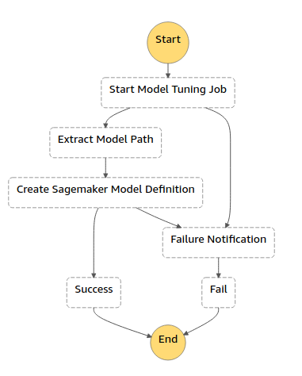
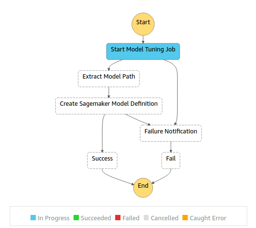
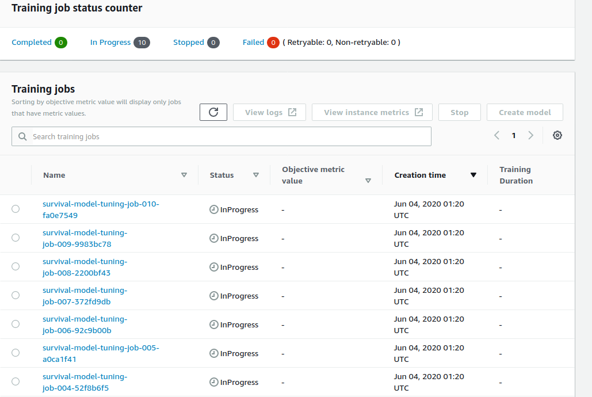
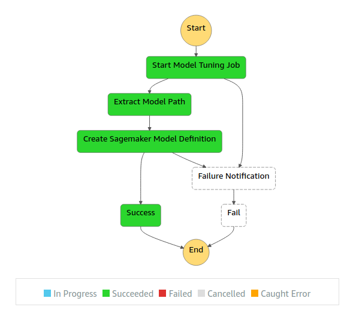
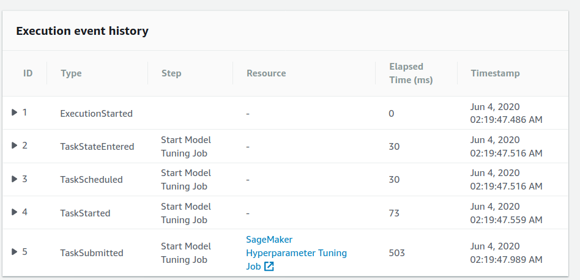
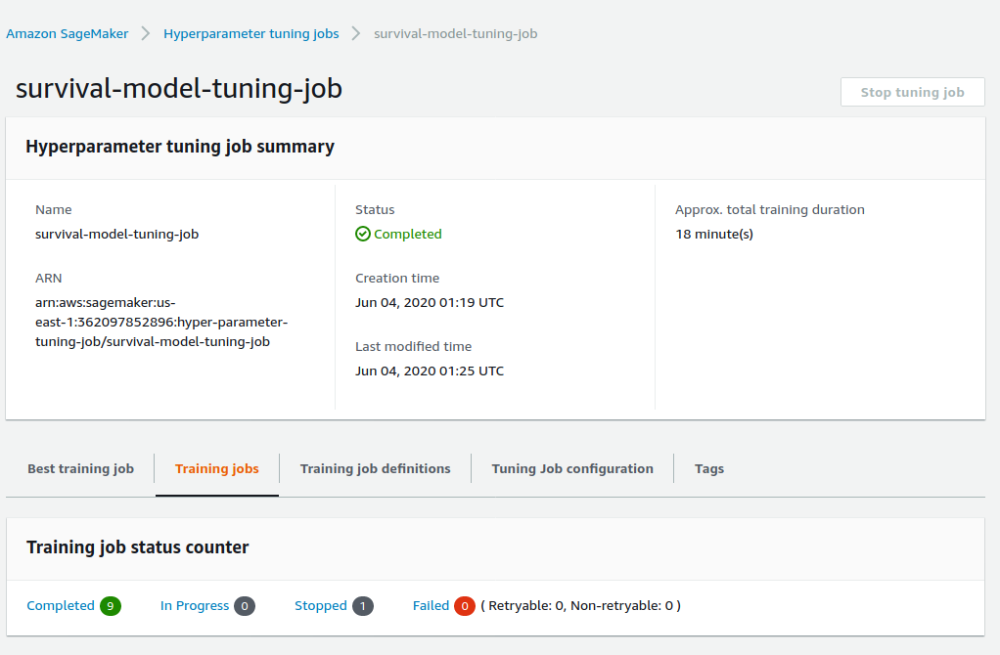
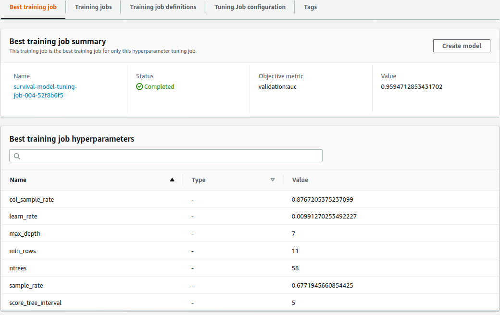
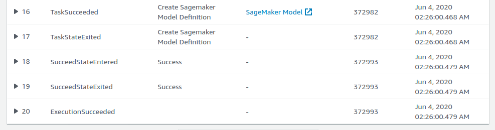
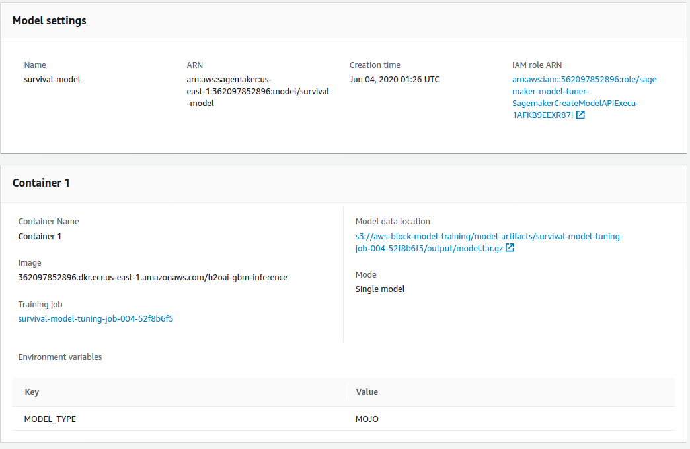

<p align="center">
  
</p>

# sagemaker-model-tuner
> A Sagemaker model hyper-parameter tuning serverless application as a Cloudformation stack

[](contributing.md)
[](https://s3-us-west-2.amazonaws.com/codefactory-us-west-2-prod-default-build-badges/passing.svg)

Current version: **1.0.0**

Lead Maintainer: [Anil Sener](mailto:senera@amazon.com)

## 📋 Table of content

 - [Installation](#-install)
 - [Metrics](#-metrics)
 - [Pre-requisites](#-pre-requisites)
 - [Description](#-description)
 - [Usage](#-usage)
 - [Screenshots](#-screenshots)
 - [See also](#-see-also)

## 🚀 Install

In order to add this block, head to your project directory in your terminal and follow the steps in [Pre-requisites](#-pre-requisites) and [Usage](#-usage) sections below.

> ⚠️ You need to have the [AWS SAM CLI](https://docs.aws.amazon.com/serverless-application-model/latest/developerguide/serverless-sam-cli-install.html) installed on your deployment machine before installing this package.

## 📊 Metrics

The below metrics displays approximate values associated with deploying and using this block.

Metric | Value
------ | ------
**Type** | Architecture
**Installation Time** | Less than 1 minute
**Audience** | Developers, Solutions Architects
**Requirements** | [aws-sam](https://docs.aws.amazon.com/serverless-application-model/latest/developerguide/serverless-sam-cli-install.html),[Python3.8](https://www.python.org/downloads/)

## 🎒 Pre-requisites

 - Ensure you have installed the [AWS SAM CLI](https://docs.aws.amazon.com/serverless-application-model/latest/developerguide/serverless-sam-cli-install.html) on your deployment machine.
 - Make sure that you have a [Sagemaker Algorithm Resource](https://docs.aws.amazon.com/sagemaker/latest/dg/sagemaker-mkt-create-algo.html) or a [Sagemaker Algorithm on AWS Marketplace](https://docs.aws.amazon.com/sagemaker/latest/dg/sagemaker-marketplace.html) already created in the AWS region in which you will execute the step-function associated with this block. A Sagemaker Algorithm Resource requires model training and inference docker image URIs. These images can be either [pre-built](https://docs.aws.amazon.com/sagemaker/latest/dg/sagemaker-algo-docker-registry-paths.html) or custom. You can create a [Sagemaker Algorithm Resource](https://docs.aws.amazon.com/sagemaker/latest/dg/sagemaker-mkt-create-algo.html) taking [H2O GBM Algorithm Resource](https://github.com/aws-samples/amazon-sagemaker-h2o-blog/tree/master/h2o-gbm-algorithm-resource) project as a reference.
 - Ensure your [Sagemaker Hyperparameter Tuning Job](https://docs.aws.amazon.com/sagemaker/latest/dg/automatic-model-tuning.html) is provisioned with enough service limits (e.g model training, managed spot training, max parallel training job limits).
 - Ensure you have an [S3 VPC endpoint](https://docs.aws.amazon.com/vpc/latest/userguide/vpc-endpoints-s3.html) or a [VPC NAT device](https://docs.aws.amazon.com/vpc/latest/userguide/vpc-nat.html) associated to the subnets defined for model tuning process.
 
## 🔰 Description

This block is to build the infrastucture required to implement an Amazon Sagemaker Model Hyperparameter Tuning Process. It creates a Step Function called `ModelTuningStateMachine` which natively integrates with Amazon Sagemaker, AWS Lambda & Amazon SNS entities that are created. This block can be used both as a standalone project or a dependency for other projects which will involves an Amazon Sagemaker Model Hyperparameter Tuning at any stage.


<p align="center">
  
</p>

## 🛠 Usage

1. Deploy the package via the SAM CLI providing the settings for deployment.

```sh
sam deploy --guided
```
2. Observe the deployed `sagemaker-model-tuner` Serverless Application in the AWS Console.

3. Navigate to the `ModelTuningStateMachine` step function in the AWS Console.

4. Select the `Start Execution` button and submit the below JSON payload.

<details><summary>See a sample of JSON payload</summary>
<p>

```json
{
  "tuningJobName": "survival-model-tuning-job",
  "tuningStrategy": "Bayesian",
  "maxNumberOfTrainingJobs": 10,
  "maxParallelTrainingJobs": 10,
  "trainingJobDefinitionName":"training-job-def-0",
  "algorithmARN": "arn:aws:sagemaker:<region>:<account-number>:algorithm/h2o-gbm-algorithm",
  "trainingJobEarlyStoppingType": "Auto",
  "enableManagedSpotTraining": true,
  "spotTrainingCheckpointS3Uri": "s3://<bucket-name>/model-training-checkpoint/",
  "inputContentType": "text/csv",
  "trainingInstanceType":"ml.c5.2xlarge",
  "trainingInstanceVolumeSizeInGB": 30,
  "channels": [
    {
      "channelName":"training",
      "s3DataSource": {
        "AttributeNames": [ ],
        "S3DataDistributionType": "FullyReplicated",
        "S3DataType": "S3Prefix",
        "S3Uri": "s3://<bucket-name>/titanic/training/train.csv"
      }
    },
    {
      "channelName":"validation",
      "s3DataSource": {
        "AttributeNames": [],
        "S3DataDistributionType": "FullyReplicated",
        "S3DataType": "S3Prefix",
        "S3Uri": "s3://<bucket-name>/titanic/validation/validation.csv"
      }
    }
  ],
  "parameterRanges": {
    "IntegerParameterRanges": [
      {
        "Name": "ntrees",
        "MinValue": "10",
        "MaxValue": "100",
        "ScalingType": "Linear"
      },
      {
        "Name": "min_rows",
        "MinValue": "10",
        "MaxValue": "30",
        "ScalingType": "Linear"
      },
      {
        "Name": "max_depth",
        "MinValue": "3",
        "MaxValue": "7",
        "ScalingType": "Linear"
      },
      {
        "Name": "score_tree_interval",
        "MinValue": "5",
        "MaxValue": "10",
        "ScalingType": "Linear"
      }
    ],
    "ContinuousParameterRanges": [
      {
        "Name": "learn_rate",
        "MinValue": "0.001",
        "MaxValue": "0.01",
        "ScalingType": "Logarithmic"
      },
      {
        "Name": "sample_rate",
        "MinValue": "0.6",
        "MaxValue": "1.0",
        "ScalingType": "Auto"
      },
      {
        "Name": "col_sample_rate",
        "MinValue": "0.7",
        "MaxValue": "0.9",
        "ScalingType": "Auto"
      }
    ],
    "CategoricalParameterRanges": [

    ]
  },
  "staticHyperParameters":{
      "stopping_metric":"auc",
      "training": "{'classification': 'true', 'target': 'Survived', 'distribution':'bernoulli','ignored_columns':'PassengerId,Name,Cabin,Ticket','categorical_columns':'Sex,Embarked,Survived,Pclass,Embarked'}",
      "balance_classes":"True",
      "seed": "1",
      "stopping_rounds":"10",
      "stopping_tolerance":"1e-9"
  },
  "model":{
    "name": "survival-model",
    "artifactsS3OutputPath":"s3://<bucket-name>/model-artifacts/",
    "artifactType": "MOJO",
    "trainingSecurityGroupIds": ["sg-c1c27b81"],
    "trainingSubnets": ["subnet-1e980630"],
    "hosting": {
      "initialInstanceCount": "1",
      "instanceType": "ml.m5.xlarge",
      "inferenceImage": "<account-number>.dkr.ecr.<region>.amazonaws.com/h2o-gbm-predictor",
      "subnets": ["subnet-1e980630","subnet-bf64c381"],
      "securityGroupIds": ["sg-c1c27b81"]
    }
  }
}
```

</p>
</details>

5. A new execution of the state machine will be triggered and the hyperparameter tuning process will start.

### SAM CLI Deployment Options

The deployment options that you can pass to the Sagemaker Model Tuner Serverless Application are described below.

Name           | Default value | Description
-------------- | ------------- | -----------
**Stack Name** | sam-app       | Name of the stack/serverless application for example `sagemaker-model-tuner`.
**AWS Region** | None          | AWS Region to deploy the infrastructure for Sagemaker Model Tuner Serverless Application.
**Parameter Environment** | `development` | Environment to tag the created resources.

### Step Function Invocation Parameters

The different parameters that you can pass to the model tuning step-function are described below.

Name           | Description
-------------- | -------------
**tuningJobName** | A Unique Name for Amazon Sagemaker Hyper-paramemeter Tuning Job.
**tuningStrategy** | Tuning Job hyperparmater search strategy, valid options are  `Bayesian` | `Random`.
**maxNumberOfTrainingJobs** | Initial number of Instances at the creation time of Amazon Sagemaker Model Endpoint.
**maxParallelTrainingJobs** | Maximum number of training jobs executed in parallel during Sagemaker Hyperparameter Tuning Job Execution. You can set this up to `10` parallel training jobs (soft limit).
**trainingJobDefinitionName** | Training Job Definition name
**algorithmARN** | Arn of [Sagemaker Algorithm Resource](https://docs.aws.amazon.com/sagemaker/latest/dg/sagemaker-mkt-create-algo.html) to be used in model training and tuning.
**autoscalingMinCapacity** | Minimum Number of Instances allowed to Scale In by Automatic Scaling Mechanism.
**autoscalingMaxCapacity** | Maximum Number of Instances allowed to Scale Out by Automatic Scaling Mechanism.
**trainingJobEarlyStoppingType** | Enable or disable early stopping for training jobs launched by Hyperparameter Tuning Job. Valid options are  `AUTO` | `Off` .
**aenableManagedSpotTraining** | Enable or disable Managed Spot Training. Valid options are  `true` | `false`
**spotTrainingCheckpointS3Uri** | Managed Spot Training S3 Checkpointing Location. Should be set as `""`, if managed spot training will not be used.
**inputContentType** | A valid Content Type permitted by Amazon Sagemaker Algorithm for all input channels channel.
**trainingInstanceType** | A valid EC2 Instance type permitted by Amazon Sagemaker Algorithm to execute the training jobs.
**trainingInstanceVolumeSizeInGB** | Training Instance Storage Volumen in GBs-
**channels** | The array of Input Data Channels. Total number of channels should match with the required channels by given Sagemaker Algorithm Resource.
**- channelName** | Name of the input channel as defined in Sagemaker Algorithm Resource.
**- s3DataSource** | S3 Data Source Input Definition for the given input channel.
**-- AttributeNames** | A list of one or more attribute names to use that are found in a specified augmented manifest file.
**-- S3DataDistributionType** | Define how to distribute the data inputs to tuning job hosts. Valid options are `FullyReplicated` | `ShardedByS3Key`.
**-- S3DataType** | Valid options are `ManifestFile` | `S3Prefix` | `AugmentedManifestFile`
**-- S3Uri** | Depending on the value specified for the S3DataType, identifies either a key name prefix or a manifest.
**parameterRanges** | Define tunable hyperparameters as defined in Sagemaker Algorithm Resource.
**- IntegerParameterRanges** | The array of IntegerParameterRange json objects that specify ranges of integer hyperparameters that a hyperparameter tuning job searches. Maximum number of `20` items.
**- ContinuousParameterRanges** | The array of ContinuousParameterRange json objects that specify ranges of continuous hyperparameters that a hyperparameter tuning job searches. Maximum number of `20` items.
**- CategoricalParameterRanges** | The array of CategoricalParameterRange json objects that specify ranges of categorical hyperparameters that a hyperparameter tuning job searches. Maximum number of `20` items.
**staticHyperParameters** | Specify the values of hyperparameters that do not change for the tuning job.
**model** | Parameters related to model.
**- name** | A Unique Name for the best Sagemaker Model selected by Hyperparameter Tuning Process, exactly as defined in Amazon Sagemaker API.
**- artifactsS3OutputPath** | An S3 location to store the model artifacts produced by Hyperparameter Tuning Process.
**- artifactType** | An Amazon Sagemaker algorithm like H2O Bring Your Own Algorithm (BYOA) image can produce `MOJO` | `BINARY` type artifacts using a container environmental variable. If it is not necessary to specify it, it can be set as empty string.
**- hosting** | Details of the production variant should be defined for the process.
**-- initialInstanceCount** | Initial number of Amazon Sagemaker Model Hosting instances at the creation time of Amazon Sagemaker Model Endpoint.
**-- instanceType** | Instance type which is allowed to be used by Amazon Sagemaker Model.
**-- inferenceImage** | (Optional) - URI of model inference/hosting docker image to serve the Amazon Sagemaker Model. If not specified, inference image will be taken from Sagemaker Algorithm Resource.
**-- acceleratorType** | (Optional) - Elastic Inference Accelerator Type for Amazon Sagemaker Model Endpoint.
**-- subnets** | Subnets to launch the Amazon Sagemaker Model Hosting instances
**-- securityGroupIds** | Security Group Ids to control access ingress/egress for Amazon Sagemaker Model Hosting instances

## 📷 Screenshots

Below are different screenshots displaying how the different stage of a Sagemaker Model Tuning looks like in the AWS Console.

### The state machine during execution

You can see below a current execution of the `ModelTuningStateMachine` in the AWS Step Functions console.


<p align="center">
  
</p>

### The Sagemaker Hyperparameter Tuning Job during execution

Below is a screenshot of training jobs with `InProgress` status created by Sagemaker Hyperparameter Tuning Job.


<p align="center">
  
</p>


### The state machine after a successful completion

You can see below a screenshot of a successful hyperparameter tuning job operated by `ModelTuningStateMachine` in the AWS Step Functions console.


<p align="center">
  
</p>

You can see below a current execution event history of the model tuning state machine in the AWS Step Functions console. Navigate to `SageMaker Hyperparameter Tuning Job` link to track status of the model tuning in detail.


<p align="center">
  
</p>

### The Sagemaker Hyperparameter Tuning Job after successful completion

Below is a screenshot of training jobs with `Completed` and `Stopped` (due to early stopping feature) status created by Sagemaker Hyperparameter Tuning Job.


<p align="center">
  
</p>

Below is a screenshot of the performance and configuration details of the training job which created the best model selected by Sagemaker Hyperparameter Tuning Job.


<p align="center">
  
</p>

### Created Amazon Sagemaker Model

Navigate to `SageMaker Model` link to the Sagemaker Model Definition in detail.


<p align="center">
  
</p>


Below is a screenshot of the detailed settings associated with the Sagemaker Model such as the location of model artifact and inference image in the AWS Console.


<p align="center">
  
</p>

## 👀 See also

 - The [AWS Sagemaker](https://docs.aws.amazon.com/sagemaker/latest/dg/whatis.html) official documentation.
 - The [AWS Steps Function](https://docs.aws.amazon.com/step-functions/latest/dg/welcome.html) official documentation.
 - The [ML Parameter Provider](https://github.com/aws-samples/amazon-sagemaker-h2o-blog/tree/master/ml-parameter-provider) project.
 - The [H2O GBM Trainer](https://github.com/aws-samples/amazon-sagemaker-h2o-blog/tree/master/h2o-gbm-trainer) project.
 - The [H2O GBM Predictor](https://github.com/aws-samples/amazon-sagemaker-h2o-blog/tree/master/h2o-gbm-predictor) project.
 - The [H2O GBM Algorithm Resource](https://github.com/aws-samples/amazon-sagemaker-h2o-blog/tree/master/h2o-gbm-algorithm-resource) project.